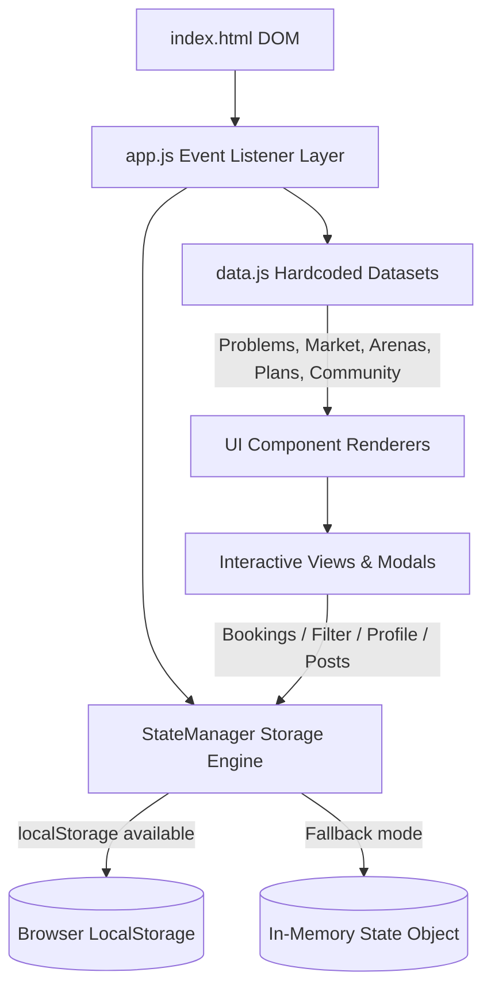
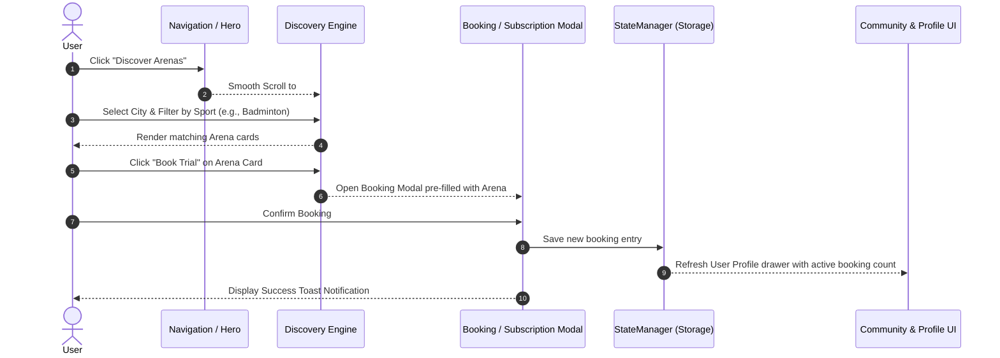

<p align="center">
  
</p>
<h1 align="center">ArenaX: Play More. Play Smart. Without ANY Limits.</h1>
<p align="center">
  <strong>Multi-sport access platform connecting players with premium sports arenas through flexible subscriptions.</strong><br/>
  <em>Explore sports → book trial sessions with equipment → subscribe seamlessly → join local communities</em>
</p>

<p align="center">
  
  
  
  
  
</p>

---

## Table of Contents

- [Overview](#overview)
- [Why ArenaX](#why-arenax)
- [Key Features](#key-features)
- [Architecture](#architecture)
- [Application Flow](#application-flow)
- [Visual UI Guide](#visual-ui-guide)
  - [Navigation and Branding](#navigation-and-branding)
  - [Hero Section](#hero-section)
  - [Problems Solved and Market Opportunity](#problems-solved-and-market-opportunity)
  - [Arena Discovery and Filters](#arena-discovery-and-filters)
  - [Trial Session Offers](#trial-session-offers)
  - [Subscription Tier Plans](#subscription-tier-plans)
  - [Community Feed and Interactions](#community-feed-and-interactions)
  - [Rewards and Gamification](#rewards-and-gamification)
  - [User Profile Drawer](#user-profile-drawer)
- [Access and Launch Instructions](#access-and-launch-instructions)
- [Troubleshooting and Failsafes](#troubleshooting-and-failsafes)
- [Author](#author)

---

## Overview

**ArenaX** is an all-in-one multi-sport subscription and facility booking platform designed to eliminate financial and logistical barriers in sports. In traditional setups, players face high upfront membership costs, expensive personal equipment fees, and fragmented booking systems, while venue operators suffer from underutilized time slots.

ArenaX bridges this gap by offering a unified subscription model—allowing members to discover nearby turf grounds, badminton courts, swimming pools, tennis courts, and pickleball arenas, book zero-risk trial sessions with included equipment, participate in local community games, and earn reward points for staying active.

---

## Why ArenaX

> **Traditional memberships force you into one venue and one sport. ArenaX gives you unlimited access across multi-city sports facilities under a single pass.**

| Feature / Metric | Traditional Sports Clubs | Pay-Per-Session Apps | ArenaX |
|---|---|---|---|
| **Upfront Commitment** | High annual upfront fees | Variable per-hour fees | Predictable flexible monthly plans |
| **Multi-Sport Freedom** | Restricted to club facilities | Requires separate bookings | Access turf, courts, pools under one pass |
| **Equipment Access** | Purchase required (~₹5,000+) | Rarely provided | Included with trial sessions at no extra cost |
| **Facility Utilization** | Peak-hour congestion | Fragmented availability | Smart off-peak pass options for arenas |
| **Community Player Match** | Manual / Noticeboard | None | Built-in sport-filtered community posts |
| **Rewards & Loyalty** | None | Limited cashback | Earn points per match, redeemable for passes |
| **Data Persistence** | Paper/Portal logins | Cloud mandatory | Local-first StateManager fallback |

---

## Key Features

### 🏟️ Multi-Sport Arena Discovery
- Search arenas across top metros (Mumbai, Delhi NCR, Bengaluru, Hyderabad, Chennai, Pune, Kolkata, Ahmedabad).
- Filter dynamically by sport chips: Cricket, Badminton, Football, Tennis, Swimming, Squash, Pickleball, and Turf.
- Instant search by name, locality, or landmark with real-time query highlight and clear filters action.

### 🎾 Zero-Risk Trial Offers
- Discounted introductory passes for beginners wanting to explore new sports.
- Free equipment rental (rackets, balls, shoes, protective gear) included out-of-the-box.
- Direct booking modal integration with instant confirmation.

### 💳 Tiered Subscription Plans
- **Flex Pass**: 4 visits/month, flexible sports selection.
- **Pro Player**: 12 visits/month + priority booking window + 1 free trial pass.
- **Elite Unlimited**: Unlimited bookings across partner facilities + free equipment rental + guest passes.
- **Multi-Sport Pass**: Specialized bundle for multi-sport athletes.

### 👥 Active Community Hub
- Post game requests, seek sparring partners, or organize local tournaments.
- Filter community posts by city and specific sports.
- Interactive liking and commenting system with local state updates.

### 🏆 Rewards & Gamification Program
- Earn points for completing bookings, writing reviews, and hosting community games.
- Unlock badges (e.g. *Multi-Sport Rookie*, *Court Master*, *Community Champion*).
- Redeem earned reward points for free trial sessions or plan discounts.

---

## Architecture

ArenaX is built using a modular Vanilla JavaScript frontend structure powered by an in-memory & `localStorage` combined persistence engine (`StateManager`).



<details>
<summary>ASCII fallback (click to expand)</summary>

```
+-------------------------------------------------------------------+
|                           index.html                              |
+-------------------------------------------------------------------+
                                  |
                                  v
+-------------------------------------------------------------------+
|                        app.js (Main Logic)                        |
|   +-----------------------+           +-----------------------+   |
|   | Event Handlers & UI   | <-------> | StateManager Engine   |   |
|   | Render Functions      |           | (LocalStorage / RAM)  |   |
|   +-----------------------+           +-----------------------+   |
+-------------------------------------------------------------------+
                                  ^
                                  |
+-------------------------------------------------------------------+
|                        data.js (Datastore)                        |
|   Arenas | Plans | Trial Offers | Community Posts | Problems      |
+-------------------------------------------------------------------+
```

</details>

---

## Application Flow



<details>
<summary>ASCII fallback (click to expand)</summary>

```
[User] ---> (Click "Discover Arenas") ---> [Discovery View]
  |                                              |
  |                                   (Select City / Sport Filter)
  v                                              v
(Click "Book Trial") ----------------> [Booking Modal]
                                                 |
                                         (Confirm Booking)
                                                 v
                                       [StateManager Storage]
                                                 |
                                     (Update Profile Drawer & Toast)
```

</details>

---

## Visual UI Guide

### Navigation and Branding
| Element | Description | Action / Trigger |
|---|---|---|
| **Brand Logo** | Displays `logo.png` image logo | Navigates to home `#hero` |
| **Nav Links** | Home, Discover, Plans, Community, Rewards, About | Smooth scroll to corresponding section |
| **Profile Button** | `#btnProfile` pill button in navbar | Opens slide-out User Profile Drawer |
| **Mobile Toggle** | Hamburger button (`#navToggle`) | Toggles responsive mobile menu drawer |

### Hero Section
| Element | Description | Action / Trigger |
|---|---|---|
| **Logo Text** | Bold stylized ArenaX brand typography | Visual header |
| **Tagline** | "Play More. Play Smart. Without ANY Limits." | Project ethos |
| **CTA Button** | `#btnGetStarted` primary action | Scrolls down directly to `#discover` |

### Problems Solved and Market Opportunity
| Panel | Content Details | Dynamic Source |
|---|---|---|
| **Problems Grid** | High upfront costs, limited trials, low arena discoverability | Rendered dynamically from `data.js` (`problems`) |
| **Market Stats** | "$100B+ Global Sports Facility Market" counter | Animated count-up effect from `marketOpportunity` |
| **Market Points** | Health consciousness, urbanization, subscription economy | Rendered dynamically from `data.js` |

### Arena Discovery and Filters
| Control | Purpose | Expected Result |
|---|---|---|
| **City Select** | Select target city (Mumbai, Bengaluru, Delhi NCR, etc.) | Filters arena cards matching selected city |
| **Search Input** | Type arena name, sport, or landmark | Real-time substring filter across arena listings |
| **Clear Button (`✕`)** | Resets active text search | Restores full search grid |
| **Sport Chips** | Toggle active sport (Cricket, Badminton, Football, etc.) | Highlights active chip and filters grid |

### Trial Session Offers
| Feature | Details | Action |
|---|---|---|
| **Trial Pass Card** | Highlights discounted fee, included equipment, duration | Displays "Book Trial Session" CTA |
| **Equipment Badge** | Green indicator "Free Equipment Included" | Assures user zero additional equipment fee |
| **Booking Modal** | Input date, preferred slot, and player count | Saves booking to `StateManager` |

### Subscription Tier Plans
| Plan Name | Best For | Included Benefits |
|---|---|---|
| **Flex Pass** | Casual Weekend Players | 4 visits/month, flexible sport selection, standard booking window |
| **Pro Player** | Regular Active Athletes | 12 visits/month, 7-day priority booking, 1 free trial pass |
| **Elite Unlimited** | Dedicated Competitors | Unlimited partner arena access, equipment included, guest passes |
| **Multi-Sport Pass** | Multi-Sport Enthusiasts | Access to turf, courts, pools, and specialized equipment access |

### Community Feed and Interactions
| Component | Functionality | User Action |
|---|---|---|
| **Create Post Button** | `#btnCreatePost` | Opens modal to post game invitation / request |
| **Sport & City Filters** | `#communityFilterSport`, `#communityFilterCity` | Filters post list by sport & location |
| **Like Button** | Heart toggle counter | Increments like count & saves state |
| **Comments Panel** | Nested discussion thread | Allows adding new text comments |

### Rewards and Gamification
| Element | Details | Storage State |
|---|---|---|
| **Points Counter** | Displays active reward points (e.g. 450 PTS) | Synced with user profile in `StateManager` |
| **Badge Grid** | Visual badges earned based on activity | Unlocked dynamically as conditions are met |
| **Redemption Offers** | Exchange points for discount vouchers & free passes | Deducts points & updates profile state |

### User Profile Drawer
| Section | Details | Interactive Actions |
|---|---|---|
| **Profile Card** | Name, Email, Preferred Sport, City | Editable via "Edit Profile" button |
| **Active Plan** | Shows current active subscription tier | Upgrade button links to `#plans` |
| **Bookings List** | Summary of upcoming & past arena bookings | Cancel booking or view booking pass |
| **Saved Arenas** | Bookmarked arena cards for quick access | Remove from saved / quick book |

---

## Access and Launch Instructions

### Option A: Local Development Run (Source Code)

ArenaX requires no build step or node server dependencies. You can run it directly using any static web server:

**Using Python Built-in Server:**
```powershell
python -m http.server 8000
```
Then navigate to `http://localhost:8000` in your web browser.

**Using Node `serve` package:**
```powershell
npx serve ./
```

**Direct Browser Launch:**
You can also double-click `index.html` to open it directly in Google Chrome, Microsoft Edge, Mozilla Firefox, or Apple Safari.

---

### Option B: Web Publishing & Hosting

ArenaX is completely static and ready for instant deployment to cloud providers:

- **GitHub Pages**: Push code to a GitHub repository and enable Pages under Repository Settings -> Pages (Source: `main` branch root `/`).
- **Vercel**: Import repository into Vercel and deploy with zero configuration.
- **Netlify**: Drag and drop the workspace folder onto Netlify Drop.

---

## Troubleshooting and Failsafes

| Issue / Symptom | Possible Cause | Failsafe / Resolution |
|---|---|---|
| **Storage Warning Toast** | Browser `localStorage` is disabled or blocked in private mode | `StateManager` automatically falls back to in-memory runtime storage. Data persists until page reload. |
| **Arenas Not Displaying** | Overly restrictive city or sport filter combination | Click the clear search button (`✕`) or select "All Cities" / "All Sports" to reset filters. |
| **Images Not Loading** | Missing local assets or path misconfiguration | Fallback SVG image placeholders render automatically via `onerror` handlers. |
| **Mobile Layout Overlap** | Viewport width below 360px | Open `test-responsive.html` to verify breakpoint layout rules. |
| **Form Submission Error** | Empty required input fields in modals | Client-side validation triggers focused error highlights and helper messages. |

---

## Author

**Felix-au** (Harshit Soni)

- 🔗 GitHub: [github.com/Felix-au](https://github.com/Felix-au)
- 📧 Email: [felixaugum@gmail.com](mailto:felixaugum@gmail.com)

---

<p align="center">
  <sub>Democratizing sports access through flexible subscriptions and community empowerment.</sub>
</p>
